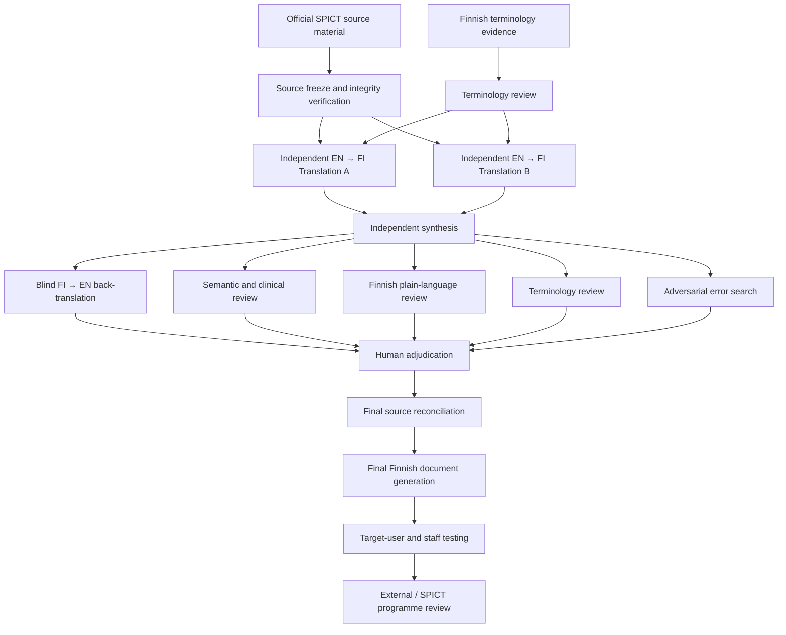

# SPICT-4ALL FI 2026

**Evidence-traceable Finnish translation and cross-cultural adaptation of SPICT-4ALL 2026**

This repository contains the methodology, translation workflow, terminology evidence, quality controls and audit trail for the Finnish adaptation of **SPICT-4ALL 2026**.

The project is being developed for expert review in accordance with the translation guidance provided by the SPICT International Programme / University of St Andrews.

> **Status:** G0, T0, T1, G1, G2, G3 and G4 complete; G5 human adjudication is in progress.  
> This repository does not yet contain a final, validated or SPICT-approved Finnish publication.

---

## Objective

The objective is to produce a high-quality Finnish SPICT-4ALL translation while preserving:

- the exact meaning of the English source
- the plain-language character of SPICT-4ALL
- clinical and contextual accuracy
- traceability of important translation decisions

Artificial intelligence is used extensively for translation, comparison and error detection, but AI output is never treated as clinical validation or accepted solely because a model produced it.

Human clinical and methodological reviewers remain the final authority.

---

## Translation architecture

The project uses a deliberately separated multi-stage translation and review architecture rather than a single-model translation.



### Independent forward translations

Two independent AI agents translate the same English source into Finnish.

Agent A does not see Agent B's translation, and Agent B does not see Agent A's translation.

This preserves genuine independence between the two forward translations.

### Synthesis

A separate model evaluates:

- the exact English source
- Translation A
- Translation B
- approved project terminology

and produces a synthesis candidate.

Important disagreements and wording decisions remain auditable.

### Blind back-translation

The synthesized Finnish text is translated back into English by an independent model that does **not** receive the original English source.

The result is used to detect possible changes in meaning.

### Independent critics

Separate review roles search for problems involving:

- semantic or clinical meaning
- omissions and additions
- negation and modality
- agency and treatment choices
- terminology
- Finnish plain language
- cultural appropriateness
- adversarial edge cases

Model agreement is evidence, not approval.

---

## Human review

Human review is a required part of the workflow.

Every final translatable unit requires explicit human disposition.

Clinically or methodologically important uncertainty is escalated to human reviewers rather than resolved automatically by model consensus.

Unresolved issues remain visible and may block release.

---

## Source integrity

The canonical document and layout source is:

`20260521-Word-template-SPICT-4ALL-translations-2026.docx`

The official source files are immutable.

The project verifies source identity and integrity using SHA-256 hashes, provenance records and structural checks.

The official change document:

`20260521-Edits-for-SPICT-4ALL-translations-2025-and-2026.docx`

is independently preserved as an authority for explicitly marked changes.

If official sources disagree, the project does not silently choose one version. The discrepancy is preserved, audited and referred for explicit human or source-authority disposition.

Translation evidence and source authority are therefore treated as separate questions.

---

## Terminology

Finnish healthcare, palliative-care and medical terminology sources are maintained as a separate evidence layer.

Terminology evidence can support Finnish wording, but it cannot override, narrow or expand the meaning of the English SPICT source.

The workflow distinguishes between:

- terminology found in reference sources
- model-generated terminology suggestions
- human terminology decisions
- explicitly approved project terminology

Only explicit human decisions may establish mandatory project terminology.

---

## Quality gates

| Gate | Purpose | Current state |
|---|---|---|
| **G0** | Official source freeze, integrity and provenance | **PASS** |
| **T0** | Terminology evidence foundation | **PASS** |
| **T1** | Terminology adjudication | **PASS** |
| **G1** | Two independent EN → FI forward translations | **PASS** |
| **G2** | Independent synthesis | **PASS** |
| **G3** | Blind FI → EN back-translation | **PASS** |
| **G4** | Independent critics and adversarial review | **PASS** |
| **G5** | Human adjudication and final source reconciliation | **IN PROGRESS** |
| **G6** | Target-user testing and external review | Pending |

Completion of one gate does not automatically resolve uncertainty belonging to another gate.

Current translation evidence state:

- **G1:** two genuinely independent complete EN → FI forward translations, 54/54 units each
- **G2:** one complete synthesized Finnish candidate, 54/54 units
- **G3:** one complete blind FI → EN back-translation, 54/54 units
- **G4:** two independent complete critic reviews, 54/54 units each; findings consolidated and audited
- **G5:** explicit human disposition of every translatable unit in progress

---

## Evidence and traceability

Each translatable source unit is designed to retain an evidence chain containing:

- unique unit identifier
- exact English source
- source hash
- source provenance
- independent translation candidates
- synthesis decision
- back-translation
- critic findings
- terminology evidence
- human disposition

Generated evidence is retained rather than destructively overwritten.

This allows important translation decisions to be reproduced and audited.

---

## Final document

The Finnish publication will be generated only from a **copy of the official Word template**.

The original English source text is preserved.

Only approved Finnish content may enter the publication workflow.

The generated DOCX must be rendered and visually inspected page by page before submission.

Publication-blocking unresolved issues must be resolved before release.

---

## Repository structure

```text
sources/official/   Official SPICT source material
data/               Canonical source units, requirements and provenance
terminology/        Terminology evidence and adjudication
config/             Quality-gate and workflow configuration
docs/               Methodology and workflow documentation
prompts/            Controlled AI role instructions
tests/              Automated integrity and workflow tests
deliverables/       Audit and review packages
```

Key documentation:

- [`docs/METHODOLOGY.md`](docs/METHODOLOGY.md)
- [`docs/WORKFLOW.md`](docs/WORKFLOW.md)
- [`AGENTS.md`](AGENTS.md)
- [`NOTICE.md`](NOTICE.md)

Implementation and developer validation commands are intentionally kept outside this project overview.

---

## Methodological principles

The workflow follows established principles of translation and cross-cultural adaptation, including:

- independent forward translations
- reconciliation and synthesis
- back-translation
- expert review
- documented decision-making
- target-user or clinical-context testing

The project adapts these principles to a multi-model AI-assisted workflow while preserving human authority.

---

## What this project does not currently claim

This repository does not currently claim that the Finnish translation is:

- clinically validated
- psychometrically validated
- approved by the University of St Andrews
- approved by the SPICT International Programme
- ready for clinical publication

Those claims require completion and documentation of the applicable human, field-testing and external-review stages.

---

## Source material and rights

SPICT and SPICT-4ALL source documents originate from the SPICT programme / University of St Andrews and retain their original rights, marks and conditions of use.

Their presence in this repository does not place those materials under an open-source licence.

See [`NOTICE.md`](NOTICE.md).

---

## Core principle

> **Source fidelity before fluency. Independent evidence before consensus. Human adjudication before acceptance.**

The project target is **zero known translation errors**.

That status may only be claimed after all applicable quality gates have passed and all known issues have been resolved.